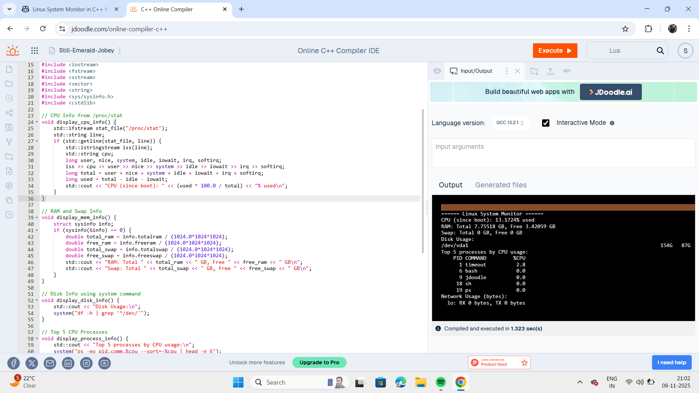

# Linux System Monitor (C++ Linux System Programming)

A terminal-based system monitor for Linux, written in C++. It displays:
- CPU statistics (from `/proc/stat`)
- RAM and Swap info (using `sysinfo`)
- Disk usage (using `df`)
- Top 5 CPU-consuming processes (`ps`)
- Network usage (from `/proc/net/dev`)

## Compilation

```bash
g++ -o system_monitor system_monitor.cpp
```

## Usage

```bash
./system_monitor
```

## Screenshots

Add output screenshots here:
- !## Screenshots



## Requirements

- Linux Operating System
- C++ compiler (`g++`)
